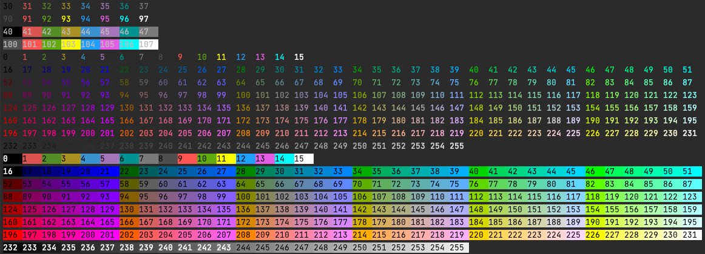

# Custom Loggers
A module that extends the standard python logging module
___

In the standard python logging module there are things that are difficult to accomplish without quite a bit of overhead. 
These classes are meant to simplify that overhead and to be extended for specific use.

# Classes
___
## CustomLogger
```python
from custom_loggers import CustomLogger
```


Extends the logging.Logger class
This is the primary class you will use/inherit

### examples
#### general use:
```python
from custom_loggers import CustomLogger, ColoredFormatter, Foreground255
#setting class level settings
CustomLogger.inclusive = True
CustomLogger.global_log_level = 0
CustomLogger.use_global_log_level_default=True

#assigning a color for a new level which is defined below
ColoredFormatter.assign_level_color("NEWLEVEL", Foreground255(226))

logger = CustomLogger("testLogger")
logger2 = CustomLogger("test2logger")
logger3 = CustomLogger("channel_tester", channel="NewChannel")
logger4 = CustomLogger("channel_tester2", channel="NewChannel")
logger3.info("channel test on")
logger4.info("channel test on")
CustomLogger.channel_disabled("NewChannel", True)
logger3.info("channel test off")
logger4.info("channel test off")
logger2.add_level("NEWLEVEL", 1, True)
logger2.log("NEWLEVEL", "original message")
logger.newlevel("my new message")
logger.log("trace", "just checking")
logger.error("Hello")
logger.info("Hello")
logger.debug("Hello")
logger.warning("Hello")
logger.critical("Hello")
try:
    raise ValueError("This is a complex error")
except Exception as e:
    logger.exception("An exception occurred")
logger.disabled = True
logger.info("This should not print because is disabled")
logger.disabled = False
CustomLogger.logging_disabled = True
logger.info("Should be disabled")
logger2.info("Should be disabled")
logger3.info("Should be disabled")
logger4.info("Should be disabled")
```
#### Extending
```python
from custom_loggers import CustomLogger,ColoredFormatter,Foreground255

class NewLogger(CustomLogger):
    use_global_log_level_default = True
    inclusive = False
    default_colored_format = '%(levelname)-8s: %(message)s'
    has_run_once=False

    CustomLogger.add_level("NEWLEVEL", 1)
    ColoredFormatter.assign_level_color("NEWLEVEL", Foreground255(77))

    def newlevel(self,msg):
        self.log("NEWLEVEL", msg)

logger=NewLogger("TestLogger")
logger.newlevel("this shows your new level")
```


### class attributes
These values affect every instance of CustomLogger

`add_script_location`: bool will add the file and line number of the file where log was called
    * In PyCharm if you install the Awesome Console plugin it will make it a hyperlink that will navigate you to
      the code where log was called

`logging_disabled`: bool enables or disables ALL Logging from CustomLogger

`default_logging_level`: int the logging level assigned to each logger by default


`use_global_log_level_default`: the default value of use_global_log which is used when comparing a loging event with the 
log leve this determines whether we compare with the instance or with the global log_level

`global_log_level`: int the current log level for all instances. (only effective when use_global_log_level is True)

`inclusive`: bool when calculating whether to log or not if inclusive is True we'll accept the set log level and below
    if false only loglevel matching the exact level will log

`default_colored_formatter`:Formatter when creating an instance with add_formatter is True this is the class used to
    create the formatter

`default_colored_format`:str the format string that the formatter will use

`default_asctime_format`:str the asctime format the formatter will use


## ColoredFormatter
```python
from custom_loggers import ColoredFormatter
```
For all things colored

The primary thing you need to know here is:
```python
from custom_loggers import ColoredFormatter
from custom_loggers import Colors

ColoredFormatter.assign_level_color("LEVELNAME",Colors.ForeGroundColors.GREEN)
```
Colored formatter has an assign_level_color method used to assign foreground and background colors. This is done via 
the Colors module discussed below. the color can be a string (usually a color escape color which is put in front of 
the log line which starts the color print)

## Colors
```python
from custom_loggers import Colors
```

Colors is an internal module for getting and combining colors and font styles.
This is done by generating the color escape codes and assigning them to the SequenceName class.

## 16 - colors
The standard 16 colors supported by the majority of mondern terminals are found in:
```python
from custom_loggers import Colors

Colors.ForeGroundColors
Colors.BackGroundColors

#colors are accessed by:
Colors.ForeGroundColors.BLUE

#You can visually see the colors like so
Colors.print_16_colors()

```

## 256 - colors
These colors may not be supported in all terminals, but give you the most variety:
```python
from custom_loggers import Colors
Colors.Foreground255
Colors.Background255

#These are accessed by assigning which color you want.
Colors.Foreground255(77)

#These can also be vissually seen like so
Colors.print_255_colors()

```

#### Color Printout



